# Báo cáo tiến độ nghiên cứu ngày 23/05/2026
## A. Công việc đã làm
- Thí nghiệm tiến hành đo giá trị với 2 tụ song song bằng 2 phương pháp ADCTouchSensor và RC+Timer
## B. Khó Khăn
## C. Báo cáo chi tiết
### 1. Cấu tạo phần cứng
- 2 miếng PCB 1 mặt và 1 miếng PCB 2 mặt bé hơn
- Hàn dây vào 4 mặt đông
- Đặt 2 miếng PCB 1 mặt ở ngoài, miếng PCB 2 mặt ở giữa, giữa các mặt đồng có lớp xốp đàn hồi tạo thành cảm biến điện dung cấu tạo giống 2 tụ mắc song song    
### 2. Sơ đồ nguyên lí
#### a. ADCTouchSensor

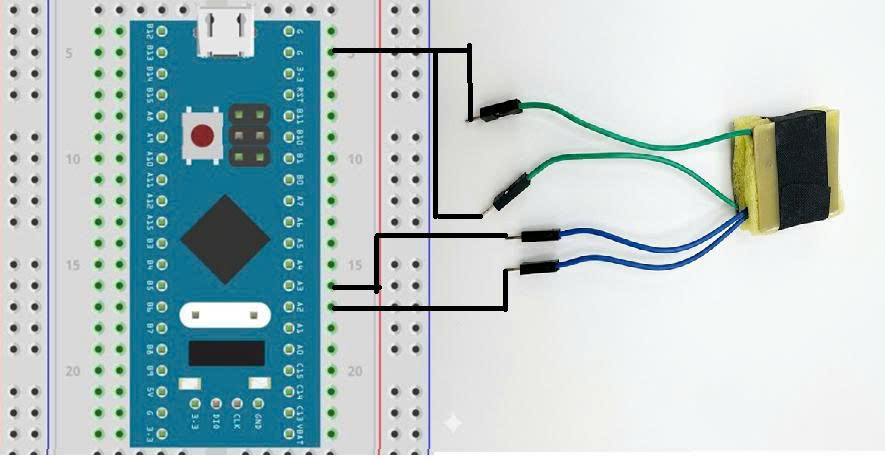

 

#### b. RC+Timer

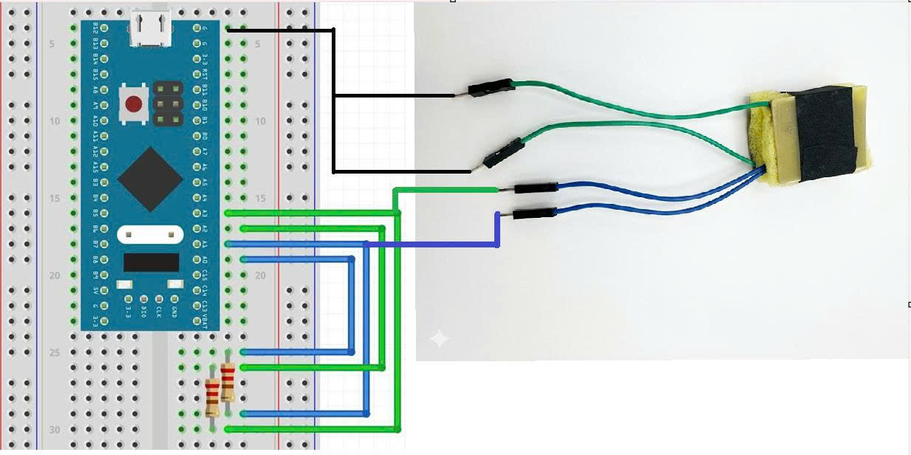

 
Giá trị điện trở: 3M

#### 3.Khối lượng đo
 

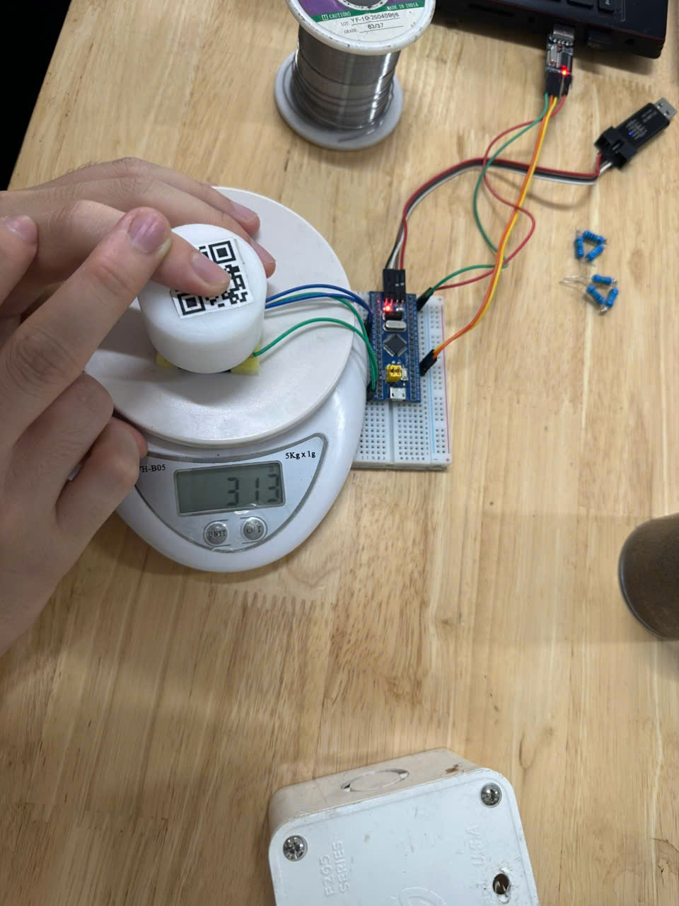

 

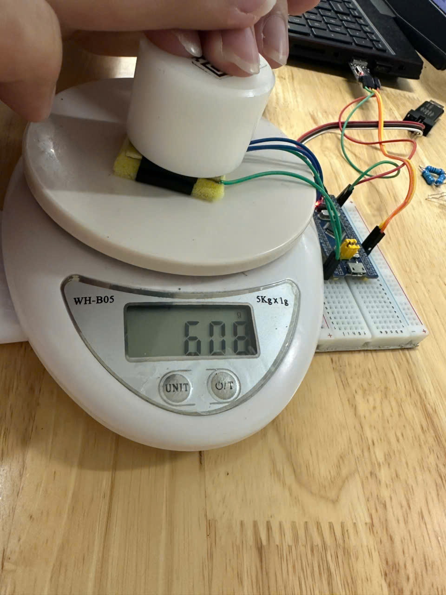

 

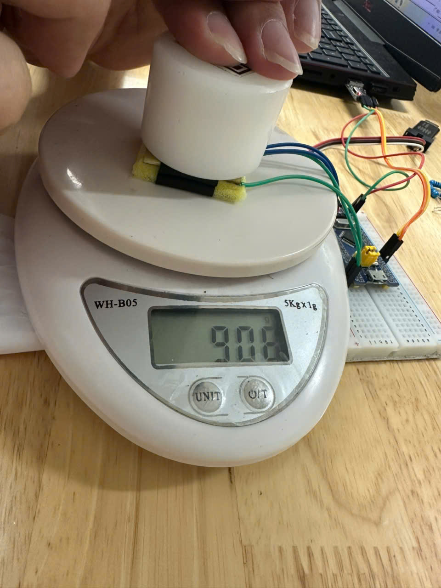

 

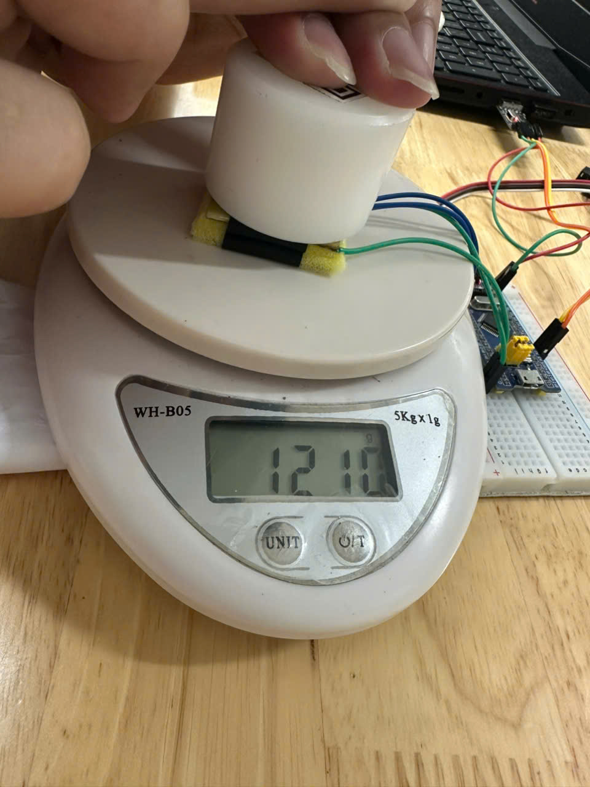

 

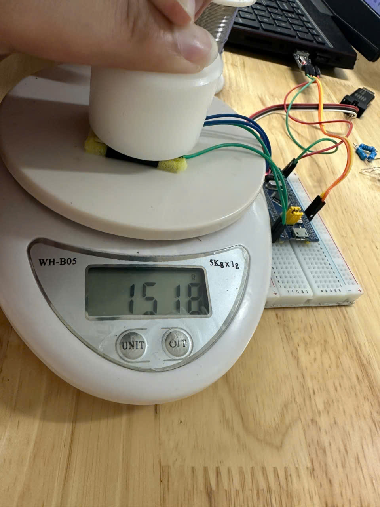

 
Khối lượng trong quá trình đo sai số ±20g

### 4. Tiến hành đo
#### a. RC+Timer
- Thời gian đo

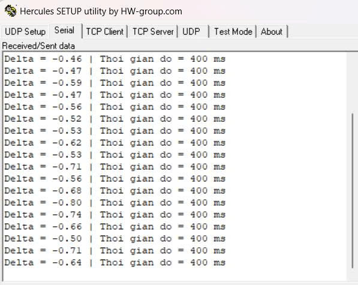

  
=> Thời gian đo khoảng 400ms cho 100 mẫu

- Đồ thị kết quả với khối lượng khác nhau

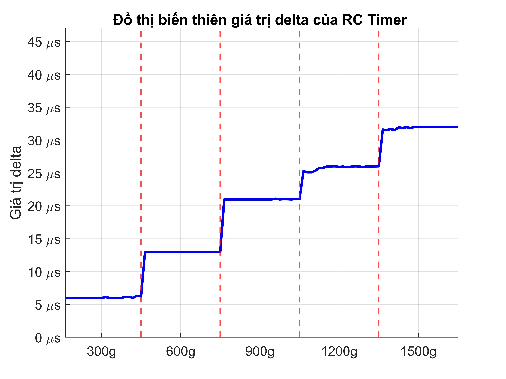

#### b. ADCTouchSensor
- Thời gian đo

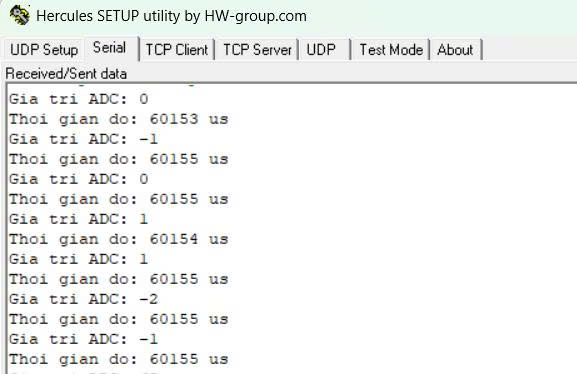

  
=> Thời gian đo khoảng 60ms cho 100 mẫu

- Đồ thị kết quả với khối lượng khác nhau

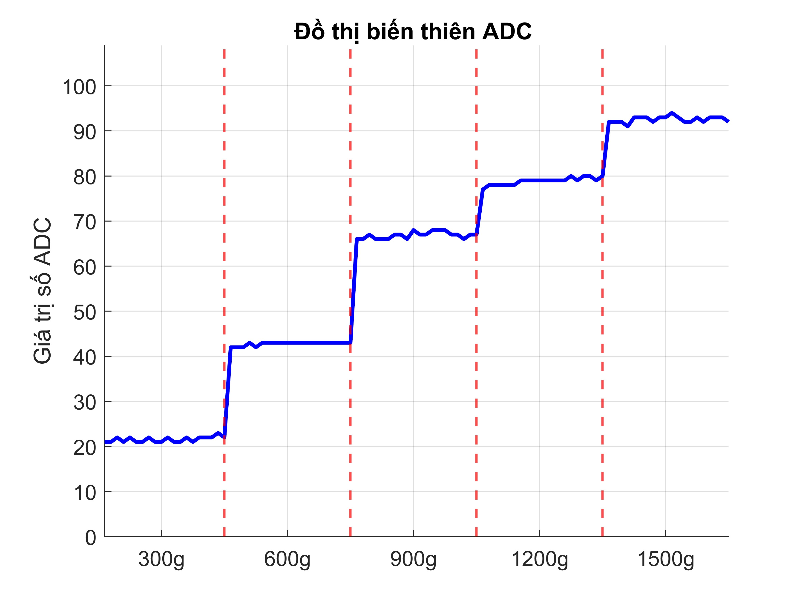

